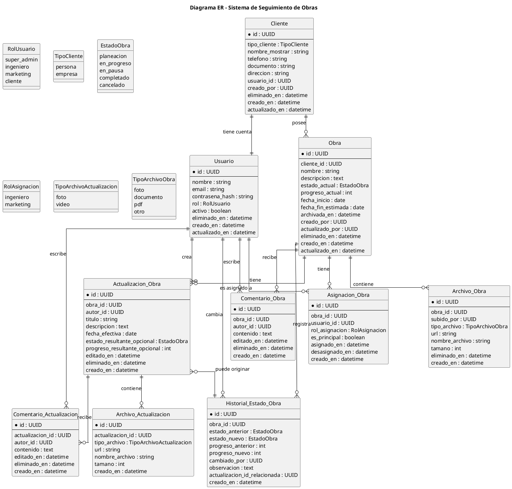

# A) Documento funcional final del MVP

## 1. Objetivo del sistema

Construir una plataforma interna para **una sola constructora** que permita:

* crear y administrar clientes
* crear y administrar obras
* asignar ingenieros y personal de marketing por obra
* publicar avances de obra
* permitir que el cliente consulte sus obras, historial, progreso y conversación
* centralizar toda la comunicación de seguimiento en un solo lugar

---

## 2. Alcance del negocio

## Tipo de negocio

* El sistema es para **una sola constructora**
* No es multiempresa
* El `super_admin` tiene **soporte total**

## Tipo de cliente

* Un cliente puede ser:

  * persona
  * empresa
* Cada cliente tiene **una sola cuenta de acceso**
* Un cliente puede tener **muchas obras**
* Una obra pertenece a **un solo cliente**

---

## 3. Roles del sistema

* `super_admin`
* `ingeniero`
* `marketing`
* `cliente`

---

## 4. Reglas por rol

## Super admin

Tiene control total del sistema.

Puede:

* crear, editar, eliminar lógicamente y activar/desactivar usuarios
* crear, editar y eliminar lógicamente clientes
* crear, editar y eliminar lógicamente obras
* reasignar responsables
* ver todas las obras
* editar o eliminar lógicamente cualquier actualización
* editar o eliminar lógicamente cualquier comentario
* actuar como soporte total

No es un rol operativo del negocio, pero **sí puede intervenir en todo**.

---

## Ingeniero

Puede:

* crear clientes
* crear cuenta de cliente
* crear obras
* asignar personal a la obra
* cambiar estado de obra
* cambiar progreso de obra
* crear actualizaciones
* editar o eliminar lógicamente **solo sus propias actualizaciones**
* comentar en actualizaciones
* comentar de forma general en la obra
* editar **solo sus propios comentarios**

Restricción:

* solo puede operar sobre obras a las que esté asignado, salvo que sea super admin

---

## Marketing

Puede:

* comentar en actualizaciones
* comentar de forma general en la obra
* crear actualizaciones
* cambiar estado de obra
* cambiar progreso de obra
* editar o eliminar lógicamente **solo sus propias actualizaciones**
* editar **solo sus propios comentarios**

No puede:

* crear obras
* cambiar el cliente asociado a la obra

Restricción:

* solo puede operar sobre obras a las que esté asignado, salvo que sea super admin

---

## Cliente

Puede:

* iniciar sesión con su cuenta
* ver todas sus obras
* ver obras activas, completadas, canceladas y archivadas
* ver actualizaciones de sus obras
* ver progreso y estado
* comentar en actualizaciones
* crear mensajes generales dentro de la obra
* editar **solo sus propios comentarios**

No puede:

* crear obras
* editar estructura de obra
* cambiar estado
* cambiar progreso
* editar actualizaciones

---

## 5. Entidades del sistema

## Usuario

Representa una cuenta que entra al sistema.

Campos sugeridos:

* id
* nombre
* email
* contraseña_hash
* rol
* activo
* eliminado_en
* creado_en
* actualizado_en

---

## Cliente

Representa la entidad comercial.

Campos sugeridos:

* id
* tipo_cliente (`persona`, `empresa`)
* nombre_mostrar
* teléfono
* documento
* dirección
* usuario_id
* creado_por
* eliminado_en
* creado_en
* actualizado_en

Reglas:

* un cliente tiene una sola cuenta
* un cliente puede tener muchas obras

---

## Obra

Representa el proyecto de construcción.

Campos sugeridos:

* id
* cliente_id
* nombre
* descripción
* estado_actual
* progreso_actual
* fecha_inicio
* fecha_fin_estimada
* archivada_en
* creado_por
* actualizado_por
* eliminado_en
* creado_en
* actualizado_en

Estados permitidos:

* `planeacion`
* `en_progreso`
* `en_pausa`
* `completado`
* `cancelado`

Reglas:

* una obra pertenece a un cliente
* una obra debe tener al menos un ingeniero asignado
* una obra puede tener varios ingenieros y varios usuarios de marketing
* una obra debe tener un ingeniero principal
* marketing principal **no es obligatorio**
* una obra completada o cancelada sigue visible, pero archivada

---

## Asignación de obra

Relaciona usuarios internos con una obra.

Campos sugeridos:

* id
* obra_id
* usuario_id
* rol_asignacion (`ingeniero`, `marketing`)
* es_principal
* asignado_en
* desasignado_en
* creado_en

Reglas:

* una obra puede tener varias asignaciones
* puede cambiar el responsable en cualquier momento
* debe quedar trazabilidad de la reasignación

---

## Actualización de obra

Representa una publicación de avance.

**Decisión actual tuya:**

* la actualización contiene **fotos o videos**
* no se definió como contenedora de PDFs o documentos

Campos sugeridos:

* id
* obra_id
* autor_id
* título
* descripción
* fecha_efectiva
* estado_resultante_opcional
* progreso_resultante_opcional
* editado_en
* eliminado_en
* creado_en

### Punto crítico

Aquí te marco algo:
si la actualización solo contiene fotos o videos, pero también tiene título y descripción, está perfecto.
Si la quieres **solo multimedia sin texto**, no te lo recomiendo porque pierdes contexto.

Mi recomendación fuerte:

* `título` obligatorio
* `descripción` opcional
* adjuntos de tipo foto/video en la actualización

---

## Archivo de actualización

Adjuntos de una actualización.

Campos sugeridos:

* id
* actualizacion_id
* tipo_archivo (`foto`, `video`)
* url
* nombre_archivo
* tamaño
* creado_en

---

## Archivo de obra

Archivos generales de la obra.

Esto sale de tu nueva decisión:

> el proyecto sí debe poder contener fotos, documentos, pdf

Campos sugeridos:

* id
* obra_id
* subido_por
* tipo_archivo (`foto`, `documento`, `pdf`, `otro`)
* url
* nombre_archivo
* tamaño
* eliminado_en
* creado_en

Uso:

* contratos
* PDFs
* documentos
* imágenes generales de la obra

---

## Historial de estado

Guarda cambios formales de estado y progreso.

Campos sugeridos:

* id
* obra_id
* estado_anterior
* estado_nuevo
* progreso_anterior
* progreso_nuevo
* cambiado_por
* observación
* actualizacion_id_relacionada
* creado_en

Reglas:

* toda modificación de estado/progreso debe quedar registrada
* esto es independiente de la actualización

---

## Comentario de actualización

Comentario dentro de una actualización.

Campos sugeridos:

* id
* actualizacion_id
* autor_id
* contenido
* editado_en
* eliminado_en
* creado_en

Reglas:

* cliente, ingeniero y marketing pueden comentar
* cada usuario solo edita sus propios comentarios
* super admin puede intervenir todo

---

## Comentario general de obra

Mensaje general no atado a una actualización.

Campos sugeridos:

* id
* obra_id
* autor_id
* contenido
* editado_en
* eliminado_en
* creado_en

Reglas:

* cliente, ingeniero y marketing pueden comentar
* cada usuario solo edita sus propios comentarios
* super admin puede intervenir todo

---

## 6. Reglas de negocio clave

## Regla 1. Creación de obra

* solo `ingeniero` o `super_admin` pueden crear una obra
* toda obra debe tener cliente asociado
* toda obra debe tener al menos un ingeniero asignado
* debe existir un ingeniero principal

---

## Regla 2. Asignación de personal

* ingenieros y marketing se asignan por obra
* una obra puede tener varios usuarios de cada tipo
* solo usuarios asignados a esa obra pueden operar sobre ella
* super admin puede intervenir sin estar asignado

---

## Regla 3. Actualizaciones

* solo ingeniero o marketing asignados pueden crear actualizaciones
* la actualización se publica directo
* no requiere aprobación previa
* solo el autor de la actualización o el super admin pueden editarla o eliminarla lógicamente

---

## Regla 4. Comentarios

* cliente, ingeniero y marketing pueden comentar
* hay dos contextos:

  * comentarios de actualización
  * comentarios generales de obra
* cada usuario solo puede editar sus propios comentarios
* el super admin puede intervenir cualquier comentario

---

## Regla 5. Estado y progreso

* el estado actual vive en la obra
* todo cambio también se guarda en historial
* si el progreso llega a `100`, el estado cambia automáticamente a `completado`
* una obra `completada` o `cancelada` queda archivada pero visible para el cliente

---

## Regla 6. Soft delete

Se usará borrado lógico en:

* usuarios
* clientes
* obras
* actualizaciones
* comentarios
* archivos

Campos recomendados:

* `eliminado_en`
* opcionalmente `eliminado_por`

---

## Regla 7. Trazabilidad

Se debe guardar al menos:

* quién creó
* quién editó
* quién cambió estado
* cuándo ocurrió
* sobre qué obra ocurrió

---

## 7. Flujo principal del sistema

## Flujo 1. Alta de cliente

1. super admin o ingeniero crea el cliente
2. se crea la cuenta de acceso del cliente
3. el cliente queda listo para asociarse a obras

---

## Flujo 2. Creación de obra

1. ingeniero crea la obra
2. asocia el cliente
3. asigna ingeniero principal
4. asigna marketing si aplica
5. define estado inicial = `planeacion`
6. define progreso inicial = `0`

---

## Flujo 3. Actualización de obra

1. ingeniero o marketing asignado entra a la obra
2. crea actualización
3. agrega título
4. agrega descripción opcional
5. sube fotos o videos
6. opcionalmente actualiza estado y/o progreso
7. si cambia estado/progreso, se registra historial

---

## Flujo 4. Comentarios

1. cliente, ingeniero o marketing entran a una actualización
2. dejan comentario
3. pueden editar solo su propio comentario
4. super admin puede intervenir cualquier comentario

---

## Flujo 5. Mensajes generales de obra

1. cliente, ingeniero o marketing entran a la obra
2. crean comentario general
3. la conversación queda asociada a la obra
4. pueden editar solo su propio comentario

---

## Flujo 6. Cierre de obra

1. el staff cambia progreso o estado
2. si progreso = 100, estado = `completado`
3. la obra pasa a archivada
4. el cliente aún puede consultarla

---

## 8. Vista funcional por módulo

## Módulo de usuarios

* crear usuario
* editar usuario
* activar/desactivar usuario
* asignar rol

## Módulo de clientes

* crear cliente
* editar cliente
* asociar cuenta
* listar obras del cliente

## Módulo de obras

* crear obra
* editar obra
* asignar staff
* cambiar estado
* cambiar progreso
* archivar obra

## Módulo de actualizaciones

* crear actualización
* editar actualización propia
* eliminar lógicamente actualización propia
* adjuntar fotos/videos

## Módulo de archivos de obra

* subir archivos generales
* listar PDFs/documentos/fotos
* eliminar lógicamente archivos

## Módulo de comentarios

* comentar actualización
* comentar obra
* editar comentario propio

## Módulo de cliente

* ver obras
* ver estado/progreso
* ver actualizaciones
* ver archivos de obra
* comentar

---

## 9. Validaciones mínimas

* progreso entre `0` y `100`
* si progreso = `100`, estado = `completado`
* una obra debe tener cliente
* una obra debe tener ingeniero principal
* solo usuarios asignados pueden operar la obra
* solo autor o super admin editan actualización
* solo autor o super admin editan comentario
* cliente solo ve sus propias obras

---

## 10. MVP sí / no

## Sí entra en MVP

* autenticación
* roles
* CRUD de usuarios
* CRUD de clientes
* CRUD de obras
* asignaciones por obra
* estado actual + historial
* progreso
* actualizaciones
* comentarios en actualización
* comentarios generales de obra
* archivos generales de obra
* vista cliente
* archivado
* soft delete
* trazabilidad básica

## No entra por ahora

* notificaciones
* aprobación de actualizaciones
* comentarios internos ocultos al cliente
* multiempresa
* múltiples cuentas por cliente empresa
* versionado de archivos
* permisos avanzados por acción
* chat en tiempo real

---

## 11. Riesgos que siguen vivos

Te lo marco directo:

### Riesgo 1

Si una actualización no tiene texto, luego el cliente no entenderá el contexto del foto/video.

**Recomendación:**
deja `título` obligatorio aunque el contenido principal sea multimedia.

### Riesgo 2

No han definido estrategia de almacenamiento de archivos.

Falta cerrar:

* proveedor
* peso máximo
* formatos permitidos
* política de borrado

### Riesgo 3

Si no construyen bien los guards por obra asignada, se les filtran permisos rápido.

### Riesgo 4

Si mezclan comentarios generales y comentarios de actualización en una sola tabla sin contexto claro, luego el frontend se vuelve confuso.

---

### B) Código PlantUML para diagrama ER en español

Te lo dejo en español, limpio y listo para pegar.

---
